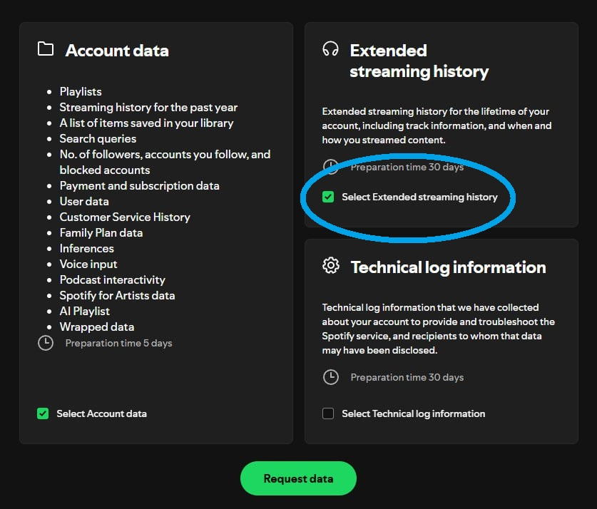

# spotify-deep-analysis-project
 A project to take a user's Spotify Extended Streaming History and display insights gained from it.

## To use:
- If you'd like to participate and see some of these insights from your spotify account, go to the following link: https://www.spotify.com/us/account/privacy/
- Sign into your Spotify and scroll to the bottom of the page. You should see something similar to the image below.

- Where you see the blue circle in the image, there will be a checkbox for Extended streaming history; make sure it is checked. The other two checkboxes (for Account data and Technical log information) are optional.
- Select "Request Data" at the bottom of the page and follow the prompts it gives from there. You should get an email which you'll need to confirm for them to start preparing your data. 
- Finally, you should recieve an email with a download link for your data in a day or so. Download and unzip the folder, putting the JSON files into the project.
