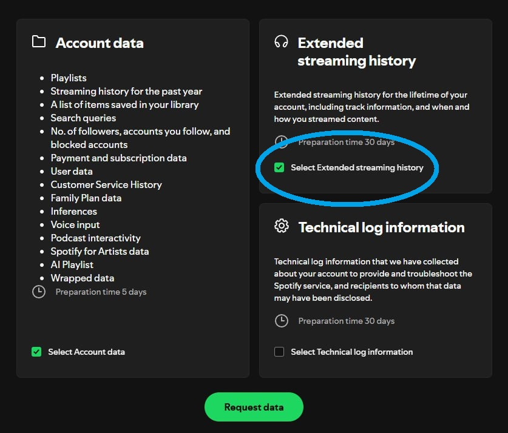

# Spotify Extended Streaming History
An interactive Streamlit web application that transforms your Spotify extended streaming history into visualizations and insights.

## Try it out:
App is currently running at: https://spotify-extended-streaming-history.streamlit.app/ 

## Features

- **Interactive Dashboards** - Daily/monthly listening timelines, cumulative trends, and year-over-year comparisons
- **Artist Analytics** - Top artists by plays or listening time with cumulative tracking
- **Song & Album Insights** - Rank your most-played tracks and albums
- **Podcast Analysis** - Separate analytics for podcast listening habits
- **Album Cover Gallery** - Fetch and display Spotify album art for your top albums
- **Dual Analysis Modes** - Switch between "Number of Plays" and "Total Playtime" metrics
- **Performance Optimized** - Handles large streaming history files efficiently

## Data Privacy

All processing occurs locally in your browser. No data is sent to external servers except Spotify API requests for album covers (which only search for public album information).

## How to get your data from Spotify:
- If you'd like to participate and see some of these insights from your spotify account, go to the following link: https://www.spotify.com/us/account/privacy/
- Sign into your Spotify and scroll to the bottom of the page. You should see something similar to the image below.

- Where you see the blue circle in the image, there will be a checkbox for Extended streaming history; make sure it is checked. The other two checkboxes (for Account data and Technical log information) are optional.
- Select "Request Data" at the bottom of the page and follow the prompts it gives from there. You should get an email which you'll need to confirm for them to start preparing your data. 
- Finally, you should recieve an email with a download link for your data in a day or so. Download and unzip the folder, putting the JSON files into the project.
